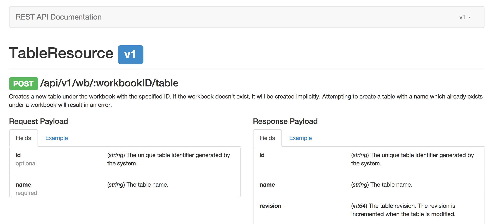

# Introducing go-rest

The goal of go-rest is to provide a framework that makes it easy to build a flexible and (mostly) unopinionated REST API with little ceremony. More important, it offers a way to build stable, resource-oriented endpoints which are production-ready.

At Workiva, we require standardized REST endpoints across all our services. This makes development more fluent and consumption easier and predictable, not just through syntax but also semantics. Many of our internal web services are written in Python, often running within Google App Engine. Within the past year, however, we've begun to build more services using Go—both on and off App Engine—because it lends itself well to many of the problems we're solving. As a result, we needed a way to build RESTful web services in a fashion similar to our Python ones.

go-rest provides the tooling to build RESTful services rapidly and in a way that meets our internal API specification. Because it takes care of a lot of the boilerplate involved with building these types of services and offers some useful utilities, we're opening go-rest up to the open-source community. The remainder of this post explains go-rest in more detail, how it can be used to build REST APIs, and how we use it at Workiva.

# Composition and Extension 

go-rest is designed to be composable and pluggable. It makes no assumptions about your stack and doesn't care what libraries you're using or what your data model looks like. This is important to us at Workiva because it means we don't dictate down to developers what they need to use to solve their problems or force any artificial design constraints. Some services are running on App Engine and use its datastore. Others run off App Engine and don't necessarily use the datastore for persistence or entity modeling. go-rest is suited to either situation.

Several pieces of go-rest are pluggable, meaning custom implementations can be provided. JSON is arguably the most common serialization format for REST APIs and it's what we use at Workiva, so the framework ships with JSON response serialization out of the box. Other response serializers, e.g. YAML or XML, can be provided.

go-rest supports a notion of middleware, which are essentially just functions invoked on API requests. This has a wide range of application, ranging from authentication to logging and stats. For example, we use OAuth2 middleware to ensure authorized resource access.

# Building Stable APIs

In order to provide fine-grained control over API input and output, go-rest uses a concept of REST rules. Rules provide schema validation and type coercion for request input and fine-grained control over response output. They can specify types in which input and output values should be coerced. If coercion fails, a meaningful error will be returned in the response. Rule validation is also built in to ensure the names and types specified on rules match up with their corresponding struct properties.

Rules provide further control in that they can be used to discard values. For example, input fields which don't have corresponding rules can be ignored. Likewise, output fields with no respective rules will be dropped from the response.

A useful property of stable REST APIs is endpoint versioning. go-rest provides support for this idea, facilitating different codepath execution based on API versions. Furthermore, rules can be specified with versions, allowing for control over input and output of versioned endpoints. This prevents new fields from leaking into old API versions.

We use a [SemVer](http://semver.org/)-like approach to managing endpoint versions. REST rules allow us to accomplish this quite easily. If endpoint stability isn't a concern, you can neglect to specify rule versions or simply return full resource representations. This can be useful for rapid prototyping.

# Generating API Documentation

Using the REST rules described above has a beneficial side effect: they provide a means of self-documentation. go-rest can use rules to generate documentation for your REST API. This documentation describes what endpoints are available and the payloads they expect, including what fields there are, which of these are required, and the expected types as well as what the response looks like. The beautiful thing is you get this all for *free*.

We make extensive use of this documentation for several reasons. First, it acts as a contract for services. We write integration tests which verify our endpoints behave as they say they do. Second, they minimize unneeded communication between teams. We publish API documentation internally and people can look at this to understand how a service is used rather than going to the team directly. Third, and related to the first point, they promote building stable, high-quality APIs. By making this information visible, we expose the surface area of the API and document how it changes. This also forces teams to be held accountable for the services they provide.

# Going Forward

go-rest serves as a foundational piece for building production-quality REST APIs and is intended to fit into existing applications with ease. It lays much of the groundwork needed and allows for more frictionless development.

REST rules provide a convenient way to maintain endpoints. While they offer a great deal of value already, there is more work to be done in order to make them even more useful. This includes pluggable type coercion, which would allow for conversion and validation of custom types. Another item is making the data validation more robust. Whether a custom-written or pre-existing library is used, this would enable semantic validation and custom validation logic. Currently, rules only provide type validation.

Further work might include building a test-harness system to speed up unit and integration testing and improving documentation generation.
